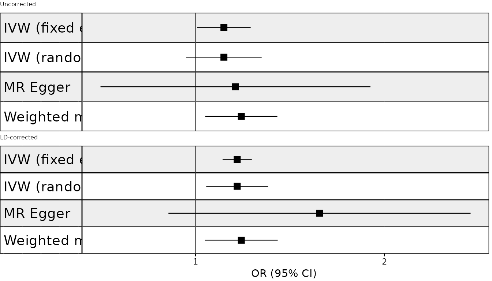
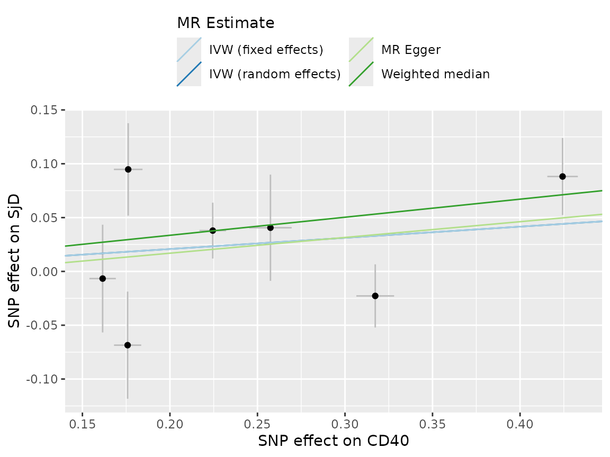
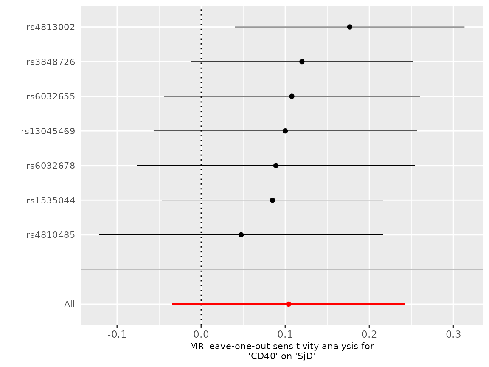
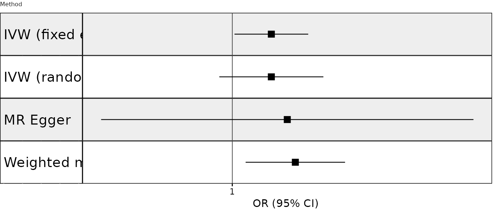
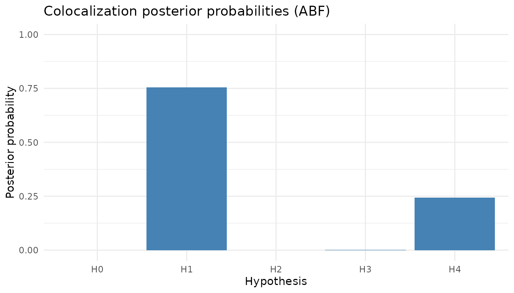
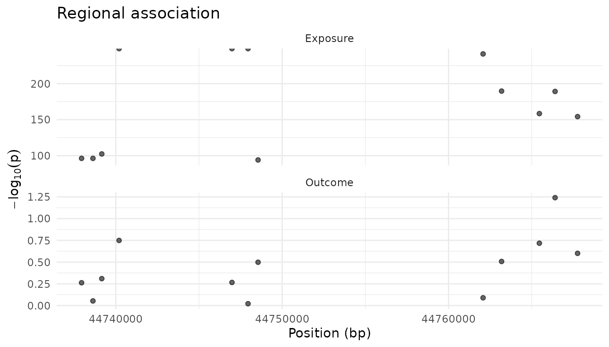

# mrpipeline User Guide

## Overview

`mrpipeline` runs two-sample Mendelian randomisation (MR) and
colocalisation for molecular exposures – currently protein QTLs (deCODE,
UKB-PPP) and single-cell eQTLs – against GWAS outcomes. It is built for
the drug-target question “does genetically proxied perturbation of this
protein affect this disease?”, so its default mode is **cis-MR**:
instruments are drawn from a window around the gene encoding the
protein.

It wraps `TwoSampleMR`, `MendelianRandomization` and `coloc` behind two
calls,
[`run_mr()`](https://github.com/BZuckerman97/mrpipeline/reference/run_mr.md)
and
[`run_coloc()`](https://github.com/BZuckerman97/mrpipeline/reference/run_coloc.md),
which each return a single result object (`mr_result`, `coloc_result`)
carrying the estimates, the instruments, the harmonisation record and
every diagnostic – so a result can be inspected, plotted and audited
after the fact.

**About the examples.** Evaluated examples on this page use the data
bundled with the package: `cd40_exposure` (CD40 protein, UKB-PPP),
`sjogren_outcome` (Sjogren’s disease) and a 50-SNP LD reference panel of
real 1000 Genomes EUR genotypes. Their output is produced when the page
is built, not typed. The outcome data are **partly synthetic** (49 of
its 50 SNPs), so the numbers illustrate the mechanics and are not a
finding about CD40 and Sjogren’s disease. Examples that need network
access or your own files are marked as not run.

## Gene Coordinate Lookup

Use
[`get_gene_coords()`](https://github.com/BZuckerman97/mrpipeline/reference/get_gene_coords.md)
to programmatically retrieve gene coordinates from Ensembl via biomaRt.
This is useful for defining cis regions in
[`run_mr()`](https://github.com/BZuckerman97/mrpipeline/reference/run_mr.md)
and
[`run_coloc()`](https://github.com/BZuckerman97/mrpipeline/reference/run_coloc.md)
without hard-coding coordinates. These two examples query Ensembl over
the network, so they are not run here; the output shown is
representative.

``` r

# GRCh38 (default)
coords <- get_gene_coords(c("CD40", "APOE"))
coords
#> # A tibble: 2 x 4
#>   hgnc_symbol chromosome     start       end
#>   <chr>       <chr>          <int>     <int>
#> 1 APOE        19          44905791  44909393
#> 2 CD40        20          44746911  44758502

# GRCh37
coords_37 <- get_gene_coords("CD40", build = "grch37")
```

The returned tibble can feed directly into
[`run_mr()`](https://github.com/BZuckerman97/mrpipeline/reference/run_mr.md)
and
[`run_coloc()`](https://github.com/BZuckerman97/mrpipeline/reference/run_coloc.md):

``` r

cd40 <- get_gene_coords("CD40", build = "grch38")

mr_res <- run_mr(
  exposure = exposure_data,
  exposure_id = "CD40",
  outcome = outcome_data,
  outcome_id = "SjD",
  instrument_region = list(
    chromosome = cd40$chromosome,
    start = cd40$start,
    end = cd40$end
  )
)
```

## Controlling PLINK Resource Usage

When running many parallel jobs (e.g. on an HPC cluster), PLINK’s
default behaviour of auto-detecting available threads and memory can
cause problems – each worker may try to reserve half the node’s RAM. Use
`plink_threads` and `plink_memory` to cap resource usage per call.

You can set these per-call, via R options, or via environment variables
(placeholder data; not run):

``` r

# Per-call (highest priority)
result <- run_mr(
  exposure = exposure_data, exposure_id = "CD40",
  outcome = outcome_data, outcome_id = "SjD",
  bfile = "/path/to/ld_ref",
  plink_threads = 1,
  plink_memory = 2000
)

# Via R options (apply to all subsequent calls in the session)
options(
  mrpipeline.plink_threads = 1,
  mrpipeline.plink_memory = 2000
)

# Via environment variables (e.g. in .Renviron or a job script) -- set
# MRPIPELINE_PLINK_THREADS to 1 and MRPIPELINE_PLINK_MEMORY to 2000
```

Priority order: explicit argument \> R option \> environment variable \>
PLINK auto-detect (`NULL`). The same parameters are available in
[`run_coloc()`](https://github.com/BZuckerman97/mrpipeline/reference/run_coloc.md).

## Setting Up an LD Reference Panel

Several steps need linkage disequilibrium (LD) between variants, which
`mrpipeline` computes with PLINK from a reference panel of genotypes:

| Step | Without `bfile` | With `bfile` |
|----|----|----|
| Instrument clumping in [`run_mr()`](https://github.com/BZuckerman97/mrpipeline/reference/run_mr.md) | OpenGWAS API (needs an `OPENGWAS_JWT` token; rate-limited) | Local PLINK |
| `run_mr(ld_correct = TRUE)` | Error | LD matrix of the instruments |
| [`run_coloc()`](https://github.com/BZuckerman97/mrpipeline/reference/run_coloc.md) (SuSiE, `coloc.signals`, LD alignment) | Required – `bfile` has no default | LD matrix of the region |
| `plot(coloc_res, type = "locuszoom")` | Required | LD colouring |

A local panel is recommended for anything beyond a quick look: it is
reproducible (the API’s panel can change), it is not rate-limited, which
matters when you batch many proteins, and it is the only option for
`ld_correct` and colocalisation.

**File structure.** `bfile` is a PLINK 1 binary fileset given by its
*prefix* – the path without an extension. `bfile = "/data/ld/EUR"`
expects `/data/ld/EUR.bed`, `/data/ld/EUR.bim` and `/data/ld/EUR.fam` to
sit side by side. Variant IDs in the `.bim` must be rsIDs matching your
summary statistics, and the panel must be on the same genome build as
your data.

**Getting a panel.** Use one matching your GWAS samples’ ancestry. The
MRC-IEU distributes the 1000 Genomes phase 3 panels (GRCh37, rsIDs) used
by OpenGWAS, split by super-population:

``` r

# Not run: a ~1.6 GB download.
download.file("http://fileserve.mrcieu.ac.uk/ld/1kg.v3.tgz", "1kg.v3.tgz")
untar("1kg.v3.tgz", exdir = "ld_ref")
bfile <- "ld_ref/EUR" # ld_ref/EUR.bed, ld_ref/EUR.bim, ld_ref/EUR.fam
```

The package also bundles a tiny panel – real 1000 Genomes EUR genotypes
for 503 individuals at the 50 CD40-region SNPs in `cd40_exposure` –
which the evaluated examples on this page use:

``` r

bfile <- sub(
  "\\.bed$",
  "",
  system.file("extdata", "ld_ref.bed", package = "mrpipeline")
)
basename(bfile)
#> [1] "ld_ref"
```

It only covers those 50 SNPs, so it is for learning the package, not for
analysis. The script that built it, `data-raw/ld_ref.R` in the package
source, shows how to cut a panel for any region straight from the 1000
Genomes VCFs.

## Formatting GWAS Data

[`run_mr()`](https://github.com/BZuckerman97/mrpipeline/reference/run_mr.md)
and
[`run_coloc()`](https://github.com/BZuckerman97/mrpipeline/reference/run_coloc.md)
take an **exposure** in TwoSampleMR format (`SNP`, `beta.exposure`,
`se.exposure`, `effect_allele.exposure`, `other_allele.exposure`,
`eaf.exposure`, `pval.exposure`, …) and an **outcome** in the
[`format_gwas()`](https://github.com/BZuckerman97/mrpipeline/reference/format_gwas.md)
outcome schema (`rsids`, `chr`, `pos`, `beta`, `se`, `eaf`, `pval`, `n`,
`effect_allele`, `other_allele`, `phenotype`).
[`format_gwas()`](https://github.com/BZuckerman97/mrpipeline/reference/format_gwas.md)
produces either from almost any summary statistics file. Source-specific
wrappers exist for deCODE
([`format_pqtl_decode()`](https://github.com/BZuckerman97/mrpipeline/reference/format_pqtl_decode.md)),
UKB-PPP
([`format_pqtl_ukbppp()`](https://github.com/BZuckerman97/mrpipeline/reference/format_pqtl_ukbppp.md))
and OneK1K single-cell eQTLs
([`format_single_cell_onek1k()`](https://github.com/BZuckerman97/mrpipeline/reference/format_single_cell_onek1k.md));
they already know their source’s allele convention, so the steps below
are for everything else.

The walkthrough in this section follows a real analysis – an AMD outcome
GWAS and a regenie exposure – from files on disk, including a
deliberately mis-oriented file. Those files do not ship with the
package, so this code is **not run** when the page is built; the `#>`
lines are representative output, abridged where marked `...`.

### Step 1: inspect the header

Look at the column names before formatting anything:

``` r

path <- "genomics_data/outcome_GWAS/AMD/IAMDGC_AMD.tsv.gz"
names(data.table::fread(path, nrows = 5))
#> [1] "SNP" "CHR" "POS" "A1" "A2" "BETA" "SE" "PVALUE" "N" "FRQ" ...
```

Compare them against the alias table in
[`?format_gwas`](https://github.com/BZuckerman97/mrpipeline/reference/format_gwas.md)
(section *Column normalisation*). Columns in the table are renamed
automatically.

### Step 2: map any columns the alias table does not know

Anything not recognised needs a `col_map` entry. Other switches:
`log10_pval = TRUE` for `-log10(p)` columns, `n = ...` when the file has
no sample-size column, `bim_path` when rsIDs (or chr/pos) are missing,
and `marker_col` for compound `CHR:POS:...` identifiers.

``` r

col_map <- list(pval = "PVALUE")
```

### Step 3: decide what A1 means

This is the step that is easy to skip and expensive to get wrong. Two
conventions share the names `A1`/`A2`:

| Convention | `A1` | `A2` | `BETA` / `FRQ` refer to |
|----|----|----|----|
| PLINK, regenie, METAL, most GWAS Catalog deposits | effect allele | other allele | `A1` |
| EPACTS, RAREMETAL, VCF-derived tables | REF | ALT | `A2` |

[`format_gwas()`](https://github.com/BZuckerman97/mrpipeline/reference/format_gwas.md)
assumes the first. A file using the second is silently read with effect
and other allele swapped, and because harmonisation then aligns alleles
by letter, every outcome beta ends up with the wrong sign while the
results look entirely plausible. To establish which convention a file
uses:

1.  **Read the README/header.** `ALLELE1`/`A1FREQ` (regenie) or
    `effect_allele` are explicit; `REF`/`ALT` means the effect is per
    ALT.

2.  **Rule out a minor allele frequency.** A MAF never exceeds 0.5, so
    if the frequency column does, it tracks one fixed allele:

    ``` r

    frq <- data.table::fread(path, select = "FRQ")[[1]]
    mean(frq > 0.5)
    #> [1] 0.155   # not a MAF -- describes a fixed allele (A1 or A2?)
    ```

3.  **Look up two or three variants.** Compare `FRQ` with a known
    population frequency (gnomAD, Ensembl, or `plink --freq` on your LD
    panel) to see whether it describes `A1` or `A2`, and check a variant
    whose effect direction is established for the trait. For AMD, CFH
    rs1061170: the C allele is the risk allele (OR about 2.5). In the
    IAMDGC file that row reads `A1 = C, A2 = T, BETA = -0.87` – read per
    `A1` the best-replicated AMD risk allele would be protective, so
    `BETA` is per `A2`.

If `A1` is REF, swap the mapping (user aliases take precedence):

``` r

col_map <- list(pval = "PVALUE", effect_allele = "A2", other_allele = "A1")
```

### Step 4: call format_gwas()

``` r

outcome <- format_gwas(
  path         = path,
  phenotype_id = "AMD",
  col_map      = col_map
)

exposure <- format_gwas(
  path         = "genomics_data/exposure_GWAS/RPS/rps.regenie",
  phenotype_id = "RPS",
  type         = "exposure",
  col_map      = list(rsids = "ID", pval = "LOG10P"),
  log10_pval   = TRUE
)
```

### Step 5: sanity-check the output

``` r

outcome[outcome$rsids == "rs1061170", c("effect_allele", "other_allele", "beta", "eaf")]
#>   effect_allele other_allele  beta   eaf
#> 1             C            T  0.87 0.38   # risk allele now has a positive beta
range(outcome$eaf, na.rm = TRUE)
```

### Step 6: the harmonisation safety net

[`run_mr()`](https://github.com/BZuckerman97/mrpipeline/reference/run_mr.md)
and
[`run_coloc()`](https://github.com/BZuckerman97/mrpipeline/reference/run_coloc.md)
run an allele orientation check after harmonisation. Among
non-palindromic SNPs with both allele frequencies, it counts how many
have `eaf.exposure` closer to `1 - eaf.outcome` than to `eaf.outcome`.
Different ancestries produce scatter; swapped alleles produce systematic
complementarity, so a clear majority (over 70% of at least 10 SNPs)
fails the check.
[`run_mr()`](https://github.com/BZuckerman97/mrpipeline/reference/run_mr.md)
harmonises its instruments together with up to 1000 further SNPs shared
by the two datasets, so the check works even for a cis-MR with three
instruments.

``` r

result <- run_mr(exposure, "RPS", outcome, "AMD", instruments = ivs)
#> Error in `run_mr()`:
#> ! Possible effect/other allele mis-assignment between "RPS" and "AMD":
#>   987/1003 (98%) non-palindromic SNPs have eaf.exposure closer to
#>   1 - eaf.outcome than to eaf.outcome.
#> i This usually means one of the two datasets labels A1/A2 as REF/ALT ...
#> i Worst offenders (effect allele in brackets):
#>   rs117756744 (G): eaf.exposure = 0.979, eaf.outcome = 0.015, 1 - eaf.outcome = 0.985
#>   ...
#> ! Palindromic SNPs in this pair were strand-aligned from these mis-assigned
#>   frequencies, so their alignment is unreliable even where the beta looks unchanged.
#> ! The check cannot tell WHICH dataset is wrong. ...
#> > Fix: re-run `format_gwas()` on the offending dataset with
#>   `col_map = list(effect_allele = "A2", other_allele = "A1")` ...

chk <- last_allele_check()          # full record, stored on pass and fail
chk$status
chk$variants[order(-chk$variants$score), ][1:10, ]
```

Two things the check cannot do. It cannot tell *which* dataset is wrong
– the comparison is symmetric – so break the tie with an independent
frequency reference (`plink --freq` on the LD panel, or `ref_frq` in
[`format_gwas()`](https://github.com/BZuckerman97/mrpipeline/reference/format_gwas.md)),
a known-direction variant as in Step 3, or provenance (a dataset that
has harmonised cleanly against other outcomes is not the suspect). And
it does not flag palindromic SNPs: their strand is resolved *from* the
frequencies, so a mis-assigned effect allele and a mis-assigned
frequency cancel and the beta can come out identical either way. Once
the check fails, treat every palindromic alignment in that pair as
unreliable and re-run after fixing the file.

Use `allele_check = "warn"` to continue with a warning, or `"none"` to
skip the condition (the record is still stored). Both are visible in
`result$params$allele_check`, which keeps the decision reviewable.

The check has a cost that scales with the size of the two datasets you
pass in, not with the number of instruments, because it has to find the
SNPs the two share before it can sample them. For a genome-wide exposure
against a genome-wide outcome (tens of millions of rows between them)
budget a few seconds per
[`run_mr()`](https://github.com/BZuckerman97/mrpipeline/reference/run_mr.md)
call; a 200k-SNP exposure takes well under a second. It runs on every
call and is not cached across calls that share a pair, so a pipeline
that calls
[`run_mr()`](https://github.com/BZuckerman97/mrpipeline/reference/run_mr.md)
twenty times against one outcome pays it twenty times.
`result$timing[["allele_check"]]` reports it, alongside the other steps,
so you can see where a slow run spends its time.

### When the check cannot run

The check needs allele frequencies in *both* datasets. OR-only GWAS
files are common and often ship without a frequency column, so no
verdict is possible. That is **not** a pass, and it says so at warning
level (issue \#21):

``` r

#> Warning:
#> ! Allele orientation could not be checked for "RPS" vs "Malignant melanoma":
#>   no harmonised variants carry allele frequencies in both datasets.
#> ! Orientation is unverified for this pair. A mis-assigned effect allele
#>   inverts every estimate and leaves no other trace, so an unchecked pair is
#>   not the same as a clean one.
#> i Verify it by anchoring on a variant whose effect direction for this trait
#>   is established beyond doubt -- no frequencies needed. See `?format_gwas`,
#>   section What does A1 mean? (subsection If the check cannot run).
```

Verify orientation by hand instead: anchor on a variant whose direction
for the trait is beyond doubt and see whether the file agrees with the
literature. For a cutaneous melanoma GWAS, rs1805007 (MC1R), rs16891982
(SLC45A2) and rs12203592 (IRF4) settle it at once – read with the
alleles swapped, all three would contradict well-replicated melanoma
genetics.
[`?format_gwas`](https://github.com/BZuckerman97/mrpipeline/reference/format_gwas.md)
(*If the check cannot run*) works the example through and covers the two
checks that come free in many designs: a positive control that comes out
the wrong way makes orientation a prime suspect, and two independent
GWAS of the same trait should agree in direction at shared variants.

Once confirmed that way, `allele_check = "none"` silences the warning
for that pair – and, being recorded in `result$params$allele_check`, the
decision stays reviewable.

### Inspecting what harmonisation did

[`summary()`](https://rdrr.io/r/base/summary.html) prints a
harmonisation breakdown, and the full unfiltered frame is on the result
object as `$harmonisation`:

``` r

summary(result)
#> -- Harmonisation --
#> * 120 candidate SNPs -> 95 kept, 25 dropped
#> * Flagged: 10 palindromic, 8 ambiguous, 7 incompatible alleles

# Which variants, and why
h <- result$harmonisation
h[!h$mr_keep, c("SNP", "palindromic", "ambiguous", "remove")]
```

The flags overlap – every ambiguous variant is palindromic – so they do
not sum to the dropped total, and which of them actually costs a variant
its place depends on `harmonise_action` (below). A variant can also be
dropped for missing beta/se, which no allele flag shows;
[`summary()`](https://rdrr.io/r/base/summary.html) reports those as
*incomplete beta/se*.

For
[`run_mr()`](https://github.com/BZuckerman97/mrpipeline/reference/run_mr.md),
`$instruments` remains the kept set the estimates are computed from, and
`$harmonisation` explains the rest. For
[`run_coloc()`](https://github.com/BZuckerman97/mrpipeline/reference/run_coloc.md),
`$harmonised_data` is still exactly the SNPs the analysis ran on –
row-aligned with the coloc datasets, which the plots depend on – and
`$harmonisation` sits alongside it.

### Choosing how palindromes are harmonised

`harmonise_action` (on both
[`run_mr()`](https://github.com/BZuckerman97/mrpipeline/reference/run_mr.md)
and
[`run_coloc()`](https://github.com/BZuckerman97/mrpipeline/reference/run_coloc.md))
sets the `action` level
[`TwoSampleMR::harmonise_data()`](https://mrcieu.github.io/TwoSampleMR/reference/harmonise_data.html)
uses:

| `harmonise_action` | Behaviour |
|----|----|
| 1 | Assume all alleles are on the forward strand: no frequency-based flip |
| 2 (default) | Infer the positive strand, resolving palindromes from allele frequencies |
| 3 | As 2, but drop every palindromic, ambiguous or incompatible SNP |

Only palindrome handling differs – non-palindromic variants are aligned
by allele letter at every level, so the orientation check’s verdict is
the same whichever you pick.

Reach for `3` when the frequencies level `2` relies on cannot be
trusted. That is exactly the situation after a failed orientation check:
a swapped effect allele and a swapped frequency cancel for a palindromic
SNP, so its strand call is unreliable even where the beta looks
unchanged. It also covers the case above, where no frequencies are
available at all – level `2` has nothing to resolve palindromes with, so
dropping them is the honest choice:

``` r

result <- run_mr(
  exposure, "RPS", outcome, "Malignant melanoma",
  instruments = ivs,
  harmonise_action = 3,   # drop palindromic SNPs rather than guess their strand
  allele_check = "none"   # orientation confirmed by anchor variant instead
)
result$params$harmonise_action
```

The cost is instruments: dropping palindromes can remove a meaningful
share of a small cis-MR’s SNPs, so check `result$results$nsnp`
afterwards.

## Running MR Analyses

### Cis-MR (quick start with API clumping)

A cis-MR needs an exposure, an outcome and the gene’s region. Setting
`instrument_region` selects genome-wide significant variants within 100
kb of it, and with no `bfile` they are LD-clumped through the OpenGWAS
API:

``` r

# Not run: needs network access and an OpenGWAS token -- see
# ieugwasr::get_opengwas_jwt().
mr_api <- run_mr(
  exposure = cd40_exposure,
  exposure_id = "CD40",
  outcome = sjogren_outcome,
  outcome_id = "SjD",
  instrument_region = list(chromosome = "20", start = 44746911, end = 44758502)
)
```

Without a `methods` argument
[`run_mr()`](https://github.com/BZuckerman97/mrpipeline/reference/run_mr.md)
runs its default set: random-effects IVW, MR-Egger, weighted median,
MR-PRESSO, contamination mixture and Steiger filtering.

### Cis-MR with local LD reference (recommended)

With a local panel the same analysis is reproducible and offline. This
is the analysis the rest of the MR sections inspect:

``` r

set.seed(1) # the weighted median's standard error is bootstrapped
mr_res <- run_mr(
  exposure = cd40_exposure,
  exposure_id = "CD40",
  outcome = sjogren_outcome,
  outcome_id = "SjD",
  instrument_region = list(chromosome = "20", start = 44746911, end = 44758502),
  rsq_thresh = 0.3,
  bfile = bfile,
  methods = c(
    "ivw_random", "ivw_fixed", "egger", "weighted_median",
    "steiger", "pleiotropy", "heterogeneity", "loo"
  )
)
```

Two arguments are worth a note. `rsq_thresh = 0.3` clumps far more
leniently than the default of 0.001: against real LD the default keeps a
single CD40 instrument (a Wald ratio, with no sensitivity analyses
possible), while 0.3 keeps 7. Instruments that correlated are counted as
independent by standard IVW, which is what [LD-corrected
MR](#ld-corrected-mr) below is for. And `methods` names every estimator
and diagnostic explicitly, so the analysis says what it ran.

`$results` holds one row per estimator:

``` r

mr_res$results[, c("method", "nsnp", "b", "se", "pval", "or")]
#>                 method nsnp         b         se       pval       or
#> 1 IVW (random effects)    7 0.1039171 0.07064066 0.14127327 1.109508
#> 2  IVW (fixed effects)    7 0.1039171 0.05004810 0.03786213 1.109508
#> 3             MR Egger    7 0.1463184 0.25272353 0.58771400 1.157565
#> 4      Weighted median    7 0.1677675 0.06749428 0.01293133 1.182662
```

### Sensitivity analyses

Every estimator makes a different assumption about invalid instruments,
so agreement between them is the reassurance, and disagreement the lead:

- **IVW** (`ivw_random`, `ivw_fixed`) assumes every instrument is valid,
  or that pleiotropy averages to zero.
- **MR-Egger** (`egger`) allows directional pleiotropy through an
  intercept, at the cost of much lower precision; `pleiotropy` tests
  that intercept against zero.
- **Weighted median** (`weighted_median`) is consistent if at least half
  of the weight comes from valid instruments.
- **MR-PRESSO** (`presso`) and the **contamination mixture** (`conmix`)
  detect or down-weight outlying instruments. Both are in the default
  `methods`; see
  [`mr_methods()`](https://github.com/BZuckerman97/mrpipeline/reference/mr_methods.md)
  below for everything available.

Here the IVW and weighted-median estimates are 0.104 and 0.168; Egger’s
slope, 0.146, is far less precise (SE 0.253). The Egger intercept,
Cochran’s Q (`heterogeneity`, needs \>= 2 instruments) and the
leave-one-out estimates (`loo`, needs \>= 3) each have their own field:

``` r

mr_res$pleiotropy[, c("egger_intercept", "se", "pval")]
#>   egger_intercept         se      pval
#> 1     -0.01235622 0.07013144 0.8670611
mr_res$heterogeneity[, c("method", "Q", "Q_df", "Q_pval")]
#>                      method        Q Q_df     Q_pval
#> 1                  MR Egger 11.87949    5 0.03647691
#> 2 Inverse variance weighted 11.95324    6 0.06302013
mr_res$loo[, c("SNP", "b", "se", "p")]
#>          SNP          b         se          p
#> 1 rs13045469 0.09998913 0.07988087 0.21066895
#> 2  rs1535044 0.08481539 0.06723545 0.20714018
#> 3  rs3848726 0.11985840 0.06750042 0.07578748
#> 4  rs4810485 0.04753534 0.08620818 0.58135829
#> 5  rs4813002 0.17668764 0.06965768 0.01119625
#> 6  rs6032655 0.10780563 0.07766969 0.16513664
#> 7  rs6032678 0.08891643 0.08444395 0.29235754
#> 8        All 0.10391708 0.07064066 0.14127327
```

The leave-one-out table re-fits IVW without each SNP in turn, and its
last row, `All`, is the full-set estimate. Here dropping rs4813002 moves
the estimate the most, from 0.104 to 0.177 – in a small instrument set
one variant can carry much of the answer.

### Which methods can I run?

[`mr_methods()`](https://github.com/BZuckerman97/mrpipeline/reference/mr_methods.md)
returns the table
[`run_mr()`](https://github.com/BZuckerman97/mrpipeline/reference/run_mr.md)
itself dispatches from – the shortcut names, what each one runs, whether
it is a fixed- or random-effects estimator, whether `ld_correct = TRUE`
applies to it, how many instruments it needs, and where its result lands
on the `mr_result`:

``` r

tab <- mrpipeline::mr_methods()
# Backticks render the field names as code, which keeps MathJax from reading
# `$results` ... `$steiger` as an inline formula.
tab$output <- paste0("`", tab$output, "`")
knitr::kable(tab)
```

| shortcut | description | label | output | model | ld_correctable | min_instruments |
|:---|:---|:---|:---|:---|:---|---:|
| ivw_random | IVW, multiplicative random effects | IVW (random effects) | `$results` | random | TRUE | 2 |
| ivw_fixed | IVW, fixed effects | IVW (fixed effects) | `$results` | fixed | TRUE | 2 |
| egger | MR Egger regression | MR Egger | `$results` | random | TRUE | 3 |
| weighted_median | Weighted median | Weighted median | `$results` | NA | FALSE | 3 |
| presso | MR-PRESSO outlier test | MR-PRESSO | `$results` | NA | FALSE | 3 |
| conmix | Contamination mixture | ConMix | `$results` | NA | FALSE | 2 |
| steiger | Steiger directionality test | NA | `$steiger` | NA | FALSE | 1 |
| pleiotropy | Egger intercept (pleiotropy) test | NA | `$pleiotropy` | NA | TRUE | 3 |
| heterogeneity | Cochran’s Q heterogeneity test | NA | `$heterogeneity` | NA | TRUE | 2 |
| loo | Leave-one-out IVW | NA | `$loo` | NA | TRUE | 3 |

`mr_methods(detail = "full")` adds the automatic Wald-ratio path (used
when exactly one instrument survives), the raw TwoSampleMR passthrough
(any `TwoSampleMR::mr_method_list()$obj` name with no shortcut,
e.g. `"mr_raps"`), and the function that actually runs on each LD path.
The same table is rendered into
[`?run_mr`](https://github.com/BZuckerman97/mrpipeline/reference/run_mr.md).
Because
[`run_mr()`](https://github.com/BZuckerman97/mrpipeline/reference/run_mr.md)
reads it rather than a separate list, it cannot drift from what the
function accepts.

The IVW shortcuts name the estimator explicitly: `ivw_random` is
multiplicative random effects (the standard error is inflated by
`max(RSE, 1)`, never deflated) and `ivw_fixed` is fixed effects (no
overdispersion adjustment). With under-dispersed instruments the two
coincide exactly. The former names `"ivw"` and `"ivw_fe"` still work but
warn.

### LD-corrected MR

Cis-MR instruments are often in linkage disequilibrium with one another,
and standard IVW treats every instrument as an independent look at the
causal effect – two correlated SNPs are counted twice and the standard
error comes out too small. `ld_correct = TRUE` computes the instruments’
LD matrix from `bfile`, re-orients it to the exposure’s effect alleles,
and fits the IVW and Egger estimators by generalised least squares with
that matrix as the weight structure (through `MendelianRandomization`
with `correl = TRUE`).

The example repeats the analysis above – same region, same
`rsq_thresh = 0.3` – with the correction switched on:

``` r

corrected <- run_mr(
  exposure = cd40_exposure,
  exposure_id = "CD40",
  outcome = sjogren_outcome,
  outcome_id = "SjD",
  instrument_region = list(chromosome = "20", start = 44746911, end = 44758502),
  rsq_thresh = 0.3,
  bfile = bfile,
  ld_correct = TRUE,
  methods = c("ivw_random", "ivw_fixed", "egger", "weighted_median", "heterogeneity")
)
#> Warning: "weighted_median" has no LD-corrected form; running
#> uncorrected.

corrected$results[, c("method", "b", "se", "model", "ld_corrected")]
#>                 method         b         se  model ld_corrected
#> 1 IVW (random effects) 0.1526528 0.05802051 random         TRUE
#> 2  IVW (fixed effects) 0.1526528 0.02730979  fixed         TRUE
#> 3             MR Egger 0.4547481 0.28286288 random         TRUE
#> 4      Weighted median 0.1677675 0.06810721   <NA>        FALSE
```

Its instruments are the 7 from before, with pairwise \|r\| up to 0.53 in
the panel – a typical lenient cis-MR set, and one with something to
correct for. Without `ld_correct` (`mr_res`, above) the IVW estimate was
0.104 (random-effects SE 0.071, fixed-effects SE 0.050) and the Egger
slope 0.146: treating correlated instruments as independent changes the
answer, not just its precision.

Note that the corrected standard errors here are *smaller*. Correction
does not always widen them: what matters is not `r` itself but the
correlation between the SNPs’ ratio estimates, which is `r` times the
sign of `beta.exposure_i * beta.exposure_j`. Where that is positive the
two instruments are counted twice over and correction widens the SE;
where it is negative their errors partly cancel and GLS extracts *more*
information than the independent-instruments model. In this set 11 of
the 21 pairs are negative, including 5 of the 6 involving rs4810485 –
the largest-effect, and so most heavily weighted, instrument – and the
standard errors fall. Such a gain leans entirely on the reference
panel’s LD matching the GWAS sample’s, so treat a large drop with
caution.

Every `$results` row states the estimator that produced it: `model` says
whether it was a fixed- or random-effects fit, and `ld_corrected`
whether the LD matrix was used. Only `ivw_random`, `ivw_fixed` and
`egger` have a correlated form; any other estimator you request runs on
the uncorrected data and warns by name – the warning above – so
`ld_correct` is never silently ignored. `summary(corrected)` lists which
methods it was and was not applied to, and `print(corrected)` tags the
primary row `[LD-corrected]`.

The diagnostics are corrected too. Cochran’s Q, the Egger intercept and
the leave-one-out estimates are all answers to “how much do my
instruments disagree?”, and that question changes once the instruments
are correlated – the generalised Q for a correlated set can differ
materially from the naive one. So under `ld_correct = TRUE`,
`$heterogeneity`, `$pleiotropy` and `$loo` come from the correlated
fits, and each carries its own `ld_corrected` column on both arms:

``` r

corrected$heterogeneity[, c("method", "Q", "Q_df", "Q_pval", "ld_corrected")]
#>                      method        Q Q_df       Q_pval ld_corrected
#> 1                  MR Egger 21.87861    5 0.0005521611         TRUE
#> 2 Inverse variance weighted 27.08182    6 0.0001397849         TRUE
```

Uncorrected, the same instruments give an IVW Q of 11.95 (p = 0.063):
here the naive test understates the disagreement between correlated
instruments.

The `method` labels in `$heterogeneity` stay TwoSampleMR’s on both arms
(Q does not depend on the fixed/random choice), so the column is the
only thing that differs. Steiger filtering is the one diagnostic left
as-is: it compares per-SNP r^2 values and involves no weight matrix.

Two things to know:

- **`ivw_random` and `ivw_fixed` mean the same thing at every instrument
  count.** `MendelianRandomization`’s own default would switch to fixed
  effects below 4 instruments – a common situation in cis-MR – so
  [`run_mr()`](https://github.com/BZuckerman97/mrpipeline/reference/run_mr.md)
  pins the model explicitly on the shortcut. Ask for the estimator you
  want by name.
- **An LD-corrected run can have fewer instruments than the same call
  uncorrected.** Instruments absent from the reference panel, or with
  ambiguous palindromic alleles, are dropped when the matrix is aligned
  to the exposure’s effect alleles.

Because of the second point, one `mr_result` is always one instrument
set under one weight matrix – `ld_correct` is a single switch, not a
request for both arms. To compare corrected and uncorrected estimates,
run both – here `mr_res` from above is the uncorrected arm – and section
them in one forest plot:

``` r

forest_plot(list("Uncorrected" = mr_res, "LD-corrected" = corrected))
```



### Genome-wide MR

### Excluding genomic regions

Use the `exclude_regions` argument to remove instruments falling in
specific genomic regions. This is commonly used to exclude the MHC
region on chromosome 6, which can introduce spurious associations due to
complex LD structure.

Supply a data frame with columns `chr`, `start`, and `end`. The bundled
data cover only the CD40 region on chromosome 20, so these two examples
use placeholder datasets and are not run:

``` r

# Exclude MHC region (GRCh37 coordinates: chr6:28,477,797-33,448,354)
mhc_grch37 <- data.frame(chr = "6", start = 28477797, end = 33448354)

result <- run_mr(
  exposure = exposure_data,
  exposure_id = "PCSK9",
  outcome = outcome_data,
  outcome_id = "CHD",
  exclude_regions = mhc_grch37
)

# GRCh38 coordinates: chr6:28,510,120-33,480,577
mhc_grch38 <- data.frame(chr = "6", start = 28510120, end = 33480577)
```

You can exclude multiple regions by stacking rows. For example, when
studying age-related macular degeneration (AMD), you might exclude both
the CFH and ARMS2/HTRA1 loci:

``` r

amd_exclusions <- data.frame(
  chr = c("1", "10"),
  start = c(196621008, 124214077),
  end = c(196716634, 124274424)
)

result <- run_mr(
  exposure = exposure_data,
  exposure_id = "CFH",
  outcome = outcome_data,
  outcome_id = "AMD",
  exclude_regions = amd_exclusions
)
```

### Manual instrument sets

You can bypass automatic instrument selection by supplying a character
vector of rsIDs to the `instruments` argument – for example, a
pre-specified pair of variants:

``` r

manual_res <- run_mr(
  exposure = cd40_exposure,
  exposure_id = "CD40",
  outcome = sjogren_outcome,
  outcome_id = "SjD",
  instruments = c("rs4810485", "rs4813002"),
  methods = c("ivw_random", "egger", "weighted_median", "heterogeneity", "loo")
)
manual_res$results[, c("method", "nsnp", "b", "se")]
#>                 method nsnp          b        se
#> 1 IVW (random effects)    2 0.08078569 0.1391913
```

Manual instruments are used as given: no p-value threshold, no clumping,
so no `bfile` is needed. With only two of them, every method that needs
three or more instruments cannot run. Rather than failing,
[`run_mr()`](https://github.com/BZuckerman97/mrpipeline/reference/run_mr.md)
records why in `$methods_skipped` (see [Interpreting MR
results](#interpreting-mr-results)).

By default, instruments missing from the exposure data produce a warning
and the analysis continues with the available SNPs:

``` r

manual_lax <- run_mr(
  exposure = cd40_exposure,
  exposure_id = "CD40",
  outcome = sjogren_outcome,
  outcome_id = "SjD",
  instruments = c("rs4810485", "rs4813002", "rs0000001"),
  methods = "ivw_random"
)
#> Warning: 1 instrument not found in exposure data: "rs0000001"
```

Set `instruments_strict = TRUE` to make that an error instead:

``` r

run_mr(
  exposure = cd40_exposure,
  exposure_id = "CD40",
  outcome = sjogren_outcome,
  outcome_id = "SjD",
  instruments = c("rs4810485", "rs4813002", "rs0000001"),
  instruments_strict = TRUE
)
#> Error in `run_mr()`:
#> ! 1 instrument not found in exposure data: "rs0000001"
```

## Interpreting MR Results

Use [`print()`](https://rdrr.io/r/base/print.html) for a one-line
summary and [`summary()`](https://rdrr.io/r/base/summary.html) for full
details:

``` r

mr_res
#> CD40 -> SjD
#> ℹ IVW (random effects): b = 0.1039, se = 0.0706, p = 0.141, OR = 1.11
#>   [0.966-1.274]
#> ℹ 7 SNPs, mean F = 856.2
summary(mr_res)
#> 
#> ── MR Results: CD40 -> SjD ─────────────────────────────────────────────────────
#> 
#> ── Method estimates ──
#> 
#> • IVW (random effects): b = 0.1039, se = 0.0706, p = 0.141, OR = 1.11
#>   [0.966-1.274] (7 SNPs)
#> • IVW (fixed effects): b = 0.1039, se = 0.05, p = 0.0379, OR = 1.11
#>   [1.006-1.224] (7 SNPs)
#> • MR Egger [random effects]: b = 0.1463, se = 0.2527, p = 0.588, OR = 1.158
#>   [0.705-1.9] (7 SNPs)
#> • Weighted median: b = 0.1678, se = 0.0675, p = 0.0129, OR = 1.183 [1.036-1.35]
#>   (7 SNPs)
#> 
#> ── Harmonisation ──
#> 
#> • 7 candidate SNPs -> 7 kept, 0 dropped
#> • Flagged: 1 palindromic
#> 
#> ── Instrument strength ──
#> 
#> • Mean F-statistic: 856.2
#> • Min F-statistic: 450.5
#> • N instruments: 7
#> 
#> ── Steiger filtering ──
#> 
#> • 7/7 SNPs explain more variance in the exposure than in the outcome
#> • Largest Steiger p-value: 1.2e-47
#> 
#> ── Pleiotropy test (Egger intercept) ──
#> 
#> • Intercept: -0.0124
#> • SE: 0.0701
#> • p-value: 0.867
#> 
#> ── Heterogeneity test (Cochran's Q) ──
#> 
#> • MR Egger: Q = 11.879, df = 5, p = 0.0365
#> • Inverse variance weighted: Q = 11.953, df = 6, p = 0.063
#> 
#> ── Leave-one-out analysis ──
#> 
#> • 8 rows (per-SNP estimates plus the pooled 'All' row); see `$loo` for the full
#>   table.
```

Beyond the estimates, three things in that output decide how far to
trust them.

**Instrument strength (`$f_stats`).** Each instrument’s F-statistic,
computed as `(beta.exposure / se.exposure)^2`, measures how strongly it
predicts the exposure. Weak instruments (conventionally F \< 10) bias
two-sample MR towards the null – or, where the exposure and outcome
samples overlap, towards the confounded observational association.
cis-pQTLs are usually very strong: here the weakest instrument has F =
450..

**Steiger filtering (`$steiger`).** For each instrument, Steiger’s test
asks whether it explains more variance in the exposure (`rsq.exposure`)
than in the outcome (`rsq.outcome`), as it should if it acts on the
outcome *through* the exposure. An instrument failing that
(`steiger_dir = FALSE`) suggests reverse causation or pleiotropy, and is
a candidate for exclusion.
[`summary()`](https://rdrr.io/r/base/summary.html) reports how many
pass; `$steiger` has the per-SNP detail:

``` r

mr_res$steiger[, c("SNP", "rsq.exposure", "rsq.outcome", "steiger_dir", "steiger_pval")]
#>          SNP rsq.exposure  rsq.outcome steiger_dir  steiger_pval
#> 1 rs13045469   0.01320879 1.632257e-05        TRUE  4.860524e-52
#> 2  rs1535044   0.01362585 1.175715e-04        TRUE  1.197745e-47
#> 3  rs3848726   0.01496293 4.581803e-05        TRUE  1.958787e-56
#> 4  rs4810485   0.06572654 1.463971e-04        TRUE 1.401242e-254
#> 5  rs4813002   0.02509251 1.454381e-05        TRUE 3.448442e-100
#> 6  rs6032655   0.01343318 4.281074e-07        TRUE  4.642902e-56
#> 7  rs6032678   0.02533329 5.156863e-05        TRUE  5.945606e-97
```

Steiger needs the exposure’s sample size; without it the test is
skipped.

**Skipped methods (`$methods_skipped`).** A method that could not run is
not an error:
[`run_mr()`](https://github.com/BZuckerman97/mrpipeline/reference/run_mr.md)
returns the rest and records a reason for each method it skipped – too
few instruments, a missing sample size, a failed fit. Always check it
before reading the absence of a row as meaningful. For the
two-instrument manual run above:

``` r

manual_res$methods_skipped
#>                       egger             weighted_median 
#> "Requires >= 3 instruments" "Requires >= 3 instruments" 
#>                  pleiotropy                         loo 
#> "Requires >= 3 instruments" "Requires >= 3 instruments"
```

[`mr_methods()`](https://github.com/BZuckerman97/mrpipeline/reference/mr_methods.md)
lists the minimum instrument count of every method.

### Plotting MR results

[`plot()`](https://rdrr.io/r/graphics/plot.default.html) produces
diagnostic plots using TwoSampleMR plotting functions (requires
`ggplot2`): `"scatter"` (the default), `"forest"` (one row per SNP),
`"funnel"` and `"loo"` (leave-one-out). Each returns TwoSampleMR’s list
of plots, one per exposure-outcome pair, so take `[[1]]` for a single
analysis:

``` r

# warning = FALSE: TwoSampleMR's leave-one-out plot draws an empty spacer
# row, which ggplot2 reports as a removed missing value
plot(mr_res, type = "scatter")[[1]]
```



``` r

plot(mr_res, type = "loo")[[1]]
```



`plot(mr_res, type = "forest")` shows one row per SNP. For a
manuscript-style forest plot summarising *methods* (IVW, MR-Egger,
weighted median, …) or *outcomes* (a primary analysis alongside
positive/negative controls), use
[`forest_plot()`](https://github.com/BZuckerman97/mrpipeline/reference/forest_plot.md)
and
[`outcome_forest_plot()`](https://github.com/BZuckerman97/mrpipeline/reference/outcome_forest_plot.md)
instead.

### Forest plots across analyses

[`forest_plot()`](https://github.com/BZuckerman97/mrpipeline/reference/forest_plot.md)
shows one row per method, for a single `mr_result` or for several
sectioned together. Fixed effects is listed above random effects by
default. Method labels do not encode LD correction (that lives in the
`ld_corrected` column), so LD-corrected results match the same defaults:

``` r

forest_plot(mr_res)
```



Pass a named list to section several results into one figure. The
[LD-corrected MR](#ld-corrected-mr) comparison above is one example; a
primary analysis alongside positive and negative controls is another.
The package bundles no control outcomes, so this and the next example
use placeholder results and are not run:

``` r

forest_plot(list(
  Primary = mr_res,
  "Positive control" = positive_control_res,
  "Negative control" = negative_control_res
))
```

[`outcome_forest_plot()`](https://github.com/BZuckerman97/mrpipeline/reference/outcome_forest_plot.md)
instead shows one row per *outcome*, for one or both IVW model variants,
optionally coloured and/or shaped by a grouping column you attach
yourself (e.g. which instrument was used). Build the combined data frame
from one or more results’ `$results`, then plot:

``` r

combined <- dplyr::bind_rows(
  mr_res$results |> dplyr::mutate(subcategory = "Primary"),
  positive_control_res$results |> dplyr::mutate(subcategory = "Positive control"),
  negative_control_res$results |> dplyr::mutate(subcategory = "Negative control")
) |>
  dplyr::mutate(
    instrument = dplyr::if_else(exposure == "CD40", "GWS instrument", "Functional instrument")
  )

outcome_forest_plot(
  combined,
  xlab = "OR (95% CI)",
  method = c("IVW (random effects)", "IVW (fixed effects)"), # both models
  colour_by = "instrument",
  shape_by = "method",
  section_order = c("Primary", "Positive control", "Negative control")
)
```

[`table_forest_plot()`](https://github.com/BZuckerman97/mrpipeline/reference/table_forest_plot.md)
shows one row per outcome with an inline result/CI/ p-value table
alongside the plotted estimate, via the `forestplot` package (requires
`forestplot`) rather than `ggplot2`. It returns a `forestplot` object –
render it yourself with
[`plot()`](https://rdrr.io/r/graphics/plot.default.html), so you control
the output device (e.g. wrap the call in
[`pdf()`](https://rdrr.io/r/grDevices/pdf.html)/[`dev.off()`](https://rdrr.io/r/grDevices/dev.html)
to save a file). Its input is a plain data frame, built here from
made-up values to show the layout:

``` r

# Illustrative values, not results.
table_dat <- data.frame(
  exposure = "Genetically-proxied NLRP3 inhibition",
  outcome = c("Coronary heart disease", "Stroke", "Type 2 diabetes"),
  n_snps = c(8, 8, 8),
  estimate = c(0.92, 0.95, 1.03),
  lower = c(0.85, 0.88, 0.94),
  upper = c(0.99, 1.02, 1.13),
  p_value = c(0.02, 0.15, 0.5)
)

fp <- table_forest_plot(table_dat, null_value = 1, xlab = "OR (95% CI)")
plot(fp)
```


## Colocalization

MR asks whether the exposure affects the outcome; colocalisation asks
whether the two traits share a causal variant in the region at all. A
cis-MR estimate driven by a variant that merely sits in LD with a
*different* outcome variant is a classic false positive, and
colocalisation is the check for it.

### Quick colocalization (ABF only)

The simplest test uses Approximate Bayes Factors (ABF), which assume at
most one causal variant per trait. Supply the formatted exposure, the
outcome in
[`format_gwas()`](https://github.com/BZuckerman97/mrpipeline/reference/format_gwas.md)
outcome format, the gene region (padded by `coloc_window`, 10 kb by
default) and an LD reference panel. Sample sizes are read from the data
when `exposure_n`/`outcome_n` are not given. Sjogren’s disease is a
case-control outcome, so `outcome_type` and the case fraction
`outcome_s` are set too (see [Case-control
outcomes](#case-control-outcomes)):

``` r

coloc_res <- run_coloc(
  exposure = cd40_exposure,
  exposure_id = "CD40",
  outcome = sjogren_outcome,
  outcome_id = "SjD",
  gene_chr = 20,
  gene_start = 44746911,
  gene_end = 44758502,
  outcome_type = "cc",
  outcome_s = 6098 / 41420,
  bfile = bfile,
  methods = "abf"
)
#> Warning in check_dataset(d = dataset2, 2): minimum p value is: 0.013794
#> If this is what you expected, this is not a problem.
#> If this is not as small as you expected, please check you supplied var(beta) and not sd(beta) for the varbeta argument. If that's not the explanation, please check the 02_data vignette.
```

`coloc` itself prints its posteriors as it runs, so that chunk’s printed
output is hidden here; its warning is kept, and is the first clue to the
result. Inspect the result object instead:

``` r

coloc_res
#> coloc_result[CD40 -> SjD]: 12 SNPs
#> ℹ ABF PP.H4 = 0.244 | PP4/(PP3+PP4) = 0.998
summary(coloc_res)
#> 
#> ── Colocalization Results ──────────────────────────────────────────────────────
#> ℹ CD40 -> SjD
#> ℹ 12 SNPs in analysis
#> 
#> ── Harmonisation ──
#> 
#> • 12 candidate SNPs -> 12 kept, 0 dropped
#> • Flagged: 1 palindromic
#> 
#> ── coloc.abf ──
#> 
#> • PP.H0 = 0
#> • PP.H1 = 0.7555
#> • PP.H2 = 0
#> • PP.H3 = 4e-04
#> • PP.H4 = 0.2441
#> • PP.H4/(PP.H3+PP.H4) = 0.9983
#> • N SNPs = 12

# Posterior probabilities directly
coloc_res$coloc_abf$summary
#>        nsnps    PP.H0.abf    PP.H1.abf    PP.H2.abf    PP.H3.abf    PP.H4.abf 
#> 1.200000e+01 0.000000e+00 7.554989e-01 0.000000e+00 4.065273e-04 2.440946e-01
```

The five hypotheses are H0 (no association with either trait), H1
(exposure only), H2 (outcome only), H3 (both, distinct causal variants)
and H4 (both, one shared variant). Here H1 dominates, PP.H1 = 0.76
against PP.H4 = 0.24: CD40 has a strong cis-pQTL, but Sjogren’s disease
has no signal in the window – its smallest p-value there is 0.014, which
is the `minimum p value` coloc warned about. So this is *absence of
evidence* for colocalisation, not evidence against a shared variant.

Note the ratio `PP.H4 / (PP.H3 + PP.H4)` that
[`print()`](https://rdrr.io/r/base/print.html) shows. It is close to 1,
but it only answers “*if* both traits had a signal, would it be shared?”
– a question that does not arise when the outcome has none. Read it only
alongside PP.H3 + PP.H4 themselves.

### Full colocalization (SuSiE + signals)

ABF’s single-causal-variant assumption breaks down in regions with
several independent signals. Adding `"susie"` and `"signals"` to
`methods` fine-maps each trait with SuSiE, then tests colocalisation
across all pairs of credible sets with `coloc.susie()`, and across
conditionally independent signals with `coloc.signals()`:

``` r

set.seed(1)
coloc_full <- run_coloc(
  exposure = cd40_exposure,
  exposure_id = "CD40",
  outcome = sjogren_outcome,
  outcome_id = "SjD",
  gene_chr = 20,
  gene_start = 44746911,
  gene_end = 44758502,
  outcome_type = "cc",
  outcome_s = 6098 / 41420,
  bfile = bfile,
  methods = c("abf", "susie", "signals")
)
```

``` r

summary(coloc_full)
#> 
#> ── Colocalization Results ──────────────────────────────────────────────────────
#> ℹ CD40 -> SjD
#> ℹ 12 SNPs in analysis
#> 
#> ── Harmonisation ──
#> 
#> • 12 candidate SNPs -> 12 kept, 0 dropped
#> • Flagged: 1 palindromic
#> 
#> ── coloc.abf ──
#> 
#> • PP.H0 = 0
#> • PP.H1 = 0.7555
#> • PP.H2 = 0
#> • PP.H3 = 4e-04
#> • PP.H4 = 0.2441
#> • PP.H4/(PP.H3+PP.H4) = 0.9983
#> • N SNPs = 12
#> 
#> ── coloc.signals ──
#> 
#> ℹ 3 signal pairs tested
#> • Hit rs4810485-rs1535044: PP.H4 = 0.654 | PP4/(PP3+PP4) = 0.982
#> • Hit rs1883833-rs1535044: PP.H4 = 0.0057 | PP4/(PP3+PP4) = 0.1431
#> • Hit rs4813002-rs1535044: PP.H4 = 0.0054 | PP4/(PP3+PP4) = 0.1363
#> 
#> ── Skipped methods ──
#> 
#> ! susie: no credible sets in outcome
```

With no outcome signal SuSiE finds 4 credible set(s) for CD40 and none
for Sjogren’s disease, so there is nothing for `coloc.susie()` to pair
up.
[`run_coloc()`](https://github.com/BZuckerman97/mrpipeline/reference/run_coloc.md)
does not fail: it records the reason in `$methods_skipped`, which
[`summary()`](https://rdrr.io/r/base/summary.html) reports under
*Skipped methods*, and still runs `coloc.signals()`. As with ABF, check
`$methods_skipped` before reading an empty field as a negative result.

`coloc.signals()` puts its best pair at PP.H4 = 0.65, higher than ABF’s
but still short of the 0.8 usually asked of evidence for colocalisation
– and it rests on an outcome whose strongest variant in the window has p
= 0.014. The two methods agree that these data cannot settle whether
CD40 and Sjogren’s disease share a variant here.

### Case-control outcomes

For a case-control trait, `outcome_type = "cc"` with `outcome_s`, the
proportion of cases (here 6,098 of 41,420 participants), tells `coloc`
how to scale the effect sizes; the default `"quant"` treats the outcome
as a continuous trait with standard deviation `outcome_sdY`. The same
applies to the exposure through `exposure_type` and `exposure_s`.
Getting it wrong changes the prior on effect sizes and so the
posteriors:

``` r

coloc_quant <- run_coloc(
  exposure = cd40_exposure,
  exposure_id = "CD40",
  outcome = sjogren_outcome,
  outcome_id = "SjD",
  gene_chr = 20,
  gene_start = 44746911,
  gene_end = 44758502,
  bfile = bfile,
  methods = "abf"
)
```

``` r

rbind(
  case_control = coloc_res$coloc_abf$summary,
  quantitative = coloc_quant$coloc_abf$summary
)
#>              nsnps PP.H0.abf PP.H1.abf PP.H2.abf    PP.H3.abf PP.H4.abf
#> case_control    12         0 0.7554989         0 0.0004065273 0.2440946
#> quantitative    12         0 0.7153464         0 0.0004843179 0.2841692
```

### Plotting coloc results

[`plot()`](https://rdrr.io/r/graphics/plot.default.html) for
`coloc_result` objects supports three plot types:

``` r

plot(coloc_res, type = "pp_bar")   # ABF posterior probabilities (default; requires ggplot2)
```



``` r

plot(coloc_res, type = "regional") # regional association plots (requires ggplot2)
```



`type = "locuszoom"` renders LD-coloured regional plots via the
`locuszoomr` package (requires `locuszoomr` and `ensembldb`, plus an
Ensembl annotation package matching your data’s genome build, e.g.
`EnsDb.Hsapiens.v75` for GRCh37 – **attached** with
[`library()`](https://rdrr.io/r/base/library.html), not just installed,
since
[`locuszoomr::locus()`](https://rdrr.io/pkg/locuszoomr/man/locus.html)
looks up a character `ens_db` on the search path). It needs a local LD
reference panel (`bfile`) and an `ens_db` – there is no genome-build
field stored on `coloc_result`, so `ens_db` must be supplied explicitly
and must match whatever build `bfile` and the coloc data actually use.
Unlike the other two plot types, this one draws directly to the current
graphics device (like a base R plot) and returns `NULL` – open a device
first if you want to save it. (Not run here: it needs the Ensembl
annotation package and writes a file.)

``` r

library(EnsDb.Hsapiens.v75)

pdf("locuszoom_plot.pdf", width = 9, height = 8)
plot(
  coloc_res,
  type = "locuszoom",
  ens_db = "EnsDb.Hsapiens.v75",
  bfile = "/path/to/ld_reference"
)
dev.off()
```

## Two-Stage Batch Workflow
