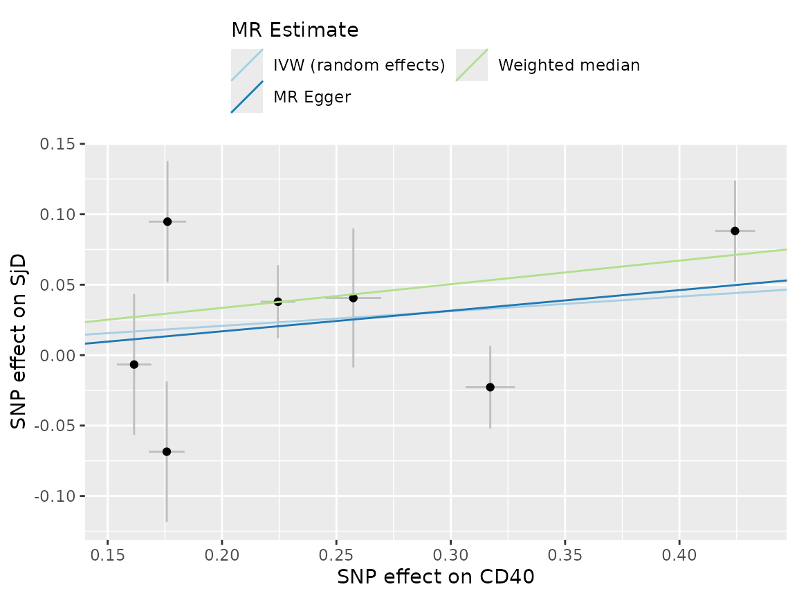
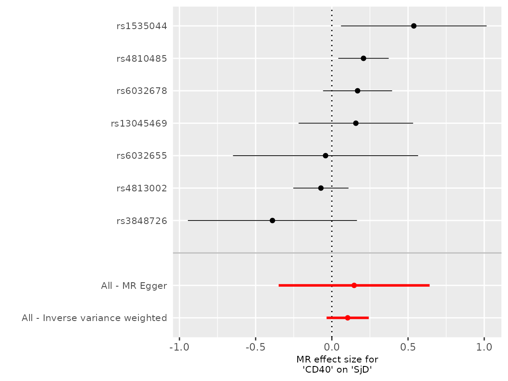
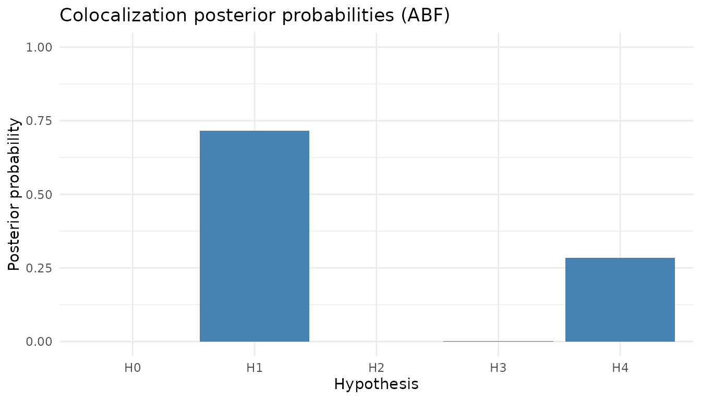

# Getting Started with mrpipeline

mrpipeline provides a streamlined interface for Mendelian randomisation
(MR) and colocalization analysis, with a focus on proteomic GWAS data
from deCODE and UKB-PPP. It wraps TwoSampleMR, coloc, and
MendelianRandomization into a consistent workflow with S3 result objects
and built-in sensitivity analyses.

## Installation

Install from GitHub:

``` r

# install.packages("pak")
pak::pak("BZuckerman97/mrpipeline")
```

## Quick start

``` r

library(mrpipeline)
```

### Mendelian randomisation

mrpipeline ships with bundled test datasets for CD40 protein and
Sjogren’s disease. Use these to explore the package without any external
data.

``` r

# Bundled datasets: cd40_exposure (formatted exposure), sjogren_outcome (outcome)
bfile <- sub("\\.bed$", "", system.file("extdata", "ld_ref.bed", package = "mrpipeline"))

# Run cis-MR (the weighted median's SE is bootstrapped, hence the seed)
set.seed(1)
mr_res <- run_mr(
  exposure = cd40_exposure,
  exposure_id = "CD40",
  outcome = sjogren_outcome,

  outcome_id = "SjD",
  instrument_region = list(chromosome = "20", start = 44746911, end = 44758502),
  rsq_thresh = 0.3,
  bfile = bfile,
  methods = c("ivw_random", "egger", "weighted_median")
)
```

Inspect the results:

``` r

mr_res
#> CD40 -> SjD
#> ℹ IVW (random effects): b = 0.1039, se = 0.0706, p = 0.141, OR = 1.11
#>   [0.966-1.274]
#> ℹ 7 SNPs, mean F = 856.2
summary(mr_res)
#> 
#> ── MR Results: CD40 -> SjD ─────────────────────────────────────────────────────
#> 
#> ── Method estimates ──
#> 
#> • IVW (random effects): b = 0.1039, se = 0.0706, p = 0.141, OR = 1.11
#>   [0.966-1.274] (7 SNPs)
#> • MR Egger [random effects]: b = 0.1463, se = 0.2527, p = 0.588, OR = 1.158
#>   [0.705-1.9] (7 SNPs)
#> • Weighted median: b = 0.1678, se = 0.0675, p = 0.0129, OR = 1.183 [1.036-1.35]
#>   (7 SNPs)
#> 
#> ── Harmonisation ──
#> 
#> • 7 candidate SNPs -> 7 kept, 0 dropped
#> • Flagged: 1 palindromic
#> 
#> ── Instrument strength ──
#> 
#> • Mean F-statistic: 856.2
#> • Min F-statistic: 450.5
#> • N instruments: 7
#> 
#> ── Pleiotropy test (Egger intercept) ──
#> 
#> • Intercept: -0.0124
#> • SE: 0.0701
#> • p-value: 0.867
```

and plot them (requires ggplot2; TwoSampleMR’s plots come as a list, one
per exposure-outcome pair):

``` r

# warning = FALSE: TwoSampleMR's forest plot draws an empty spacer row, which
# ggplot2 reports as a removed missing value
plot(mr_res, type = "scatter")[[1]]
```



``` r

plot(mr_res, type = "forest")[[1]]
```



The `mr_result` object stores the full results table, harmonised
instruments, F-statistics, Steiger filtering output, and any skipped
methods — accessible via `mr_res$results`, `mr_res$instruments`, etc.

### Colocalization

``` r

coloc_res <- run_coloc(
  exposure = cd40_exposure,
  exposure_id = "CD40",
  outcome = sjogren_outcome,
  outcome_id = "SjD",
  gene_chr = "20",
  gene_start = 44746911,
  gene_end = 44758502,
  bfile = bfile,
  methods = "abf"
)
```

``` r

coloc_res
#> coloc_result[CD40 -> SjD]: 12 SNPs
#> ℹ ABF PP.H4 = 0.284 | PP4/(PP3+PP4) = 0.998
summary(coloc_res)
#> 
#> ── Colocalization Results ──────────────────────────────────────────────────────
#> ℹ CD40 -> SjD
#> ℹ 12 SNPs in analysis
#> 
#> ── Harmonisation ──
#> 
#> • 12 candidate SNPs -> 12 kept, 0 dropped
#> • Flagged: 1 palindromic
#> 
#> ── coloc.abf ──
#> 
#> • PP.H0 = 0
#> • PP.H1 = 0.7153
#> • PP.H2 = 0
#> • PP.H3 = 5e-04
#> • PP.H4 = 0.2842
#> • PP.H4/(PP.H3+PP.H4) = 0.9983
#> • N SNPs = 12
```

``` r

plot(coloc_res, type = "pp_bar")
```



The bundled outcome data are partly synthetic, so these numbers
illustrate the workflow rather than a finding.
[`vignette("mrpipeline-user-guide")`](https://github.com/BZuckerman97/mrpipeline/articles/mrpipeline-user-guide.md)
walks through what each part of the output means.

### Gene coordinate lookup

Look up genomic coordinates for HGNC gene symbols via Ensembl (requires
the `biomaRt` package). Not run here, as it needs network access:

``` r

coords <- get_gene_coords(c("CD40", "APOE"), build = "grch38")
coords
```

These coordinates can be passed directly to
[`run_mr()`](https://github.com/BZuckerman97/mrpipeline/reference/run_mr.md)
and
[`run_coloc()`](https://github.com/BZuckerman97/mrpipeline/reference/run_coloc.md)
via the `instrument_region` and `gene_*` arguments.

## Formatting exposure data

mrpipeline includes formatters for common proteomic GWAS sources:

- [`format_pqtl_decode()`](https://github.com/BZuckerman97/mrpipeline/reference/format_pqtl_decode.md)
  — deCODE genetics
- [`format_pqtl_ukbppp()`](https://github.com/BZuckerman97/mrpipeline/reference/format_pqtl_ukbppp.md)
  — UKB-PPP (Olink)
- [`format_single_cell_onek1k()`](https://github.com/BZuckerman97/mrpipeline/reference/format_single_cell_onek1k.md)
  — OneK1K single-cell eQTL

Each returns data formatted for TwoSampleMR, ready to pass to
[`run_mr()`](https://github.com/BZuckerman97/mrpipeline/reference/run_mr.md).

## Further reading

- [`vignette("mrpipeline-user-guide")`](https://github.com/BZuckerman97/mrpipeline/articles/mrpipeline-user-guide.md)
  — detailed usage examples
- [`vignette("mrpipeline-developer-guide")`](https://github.com/BZuckerman97/mrpipeline/articles/mrpipeline-developer-guide.md)
  — architecture and internals
